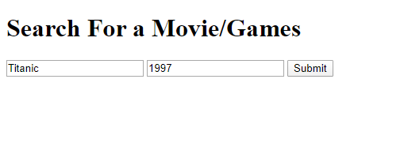
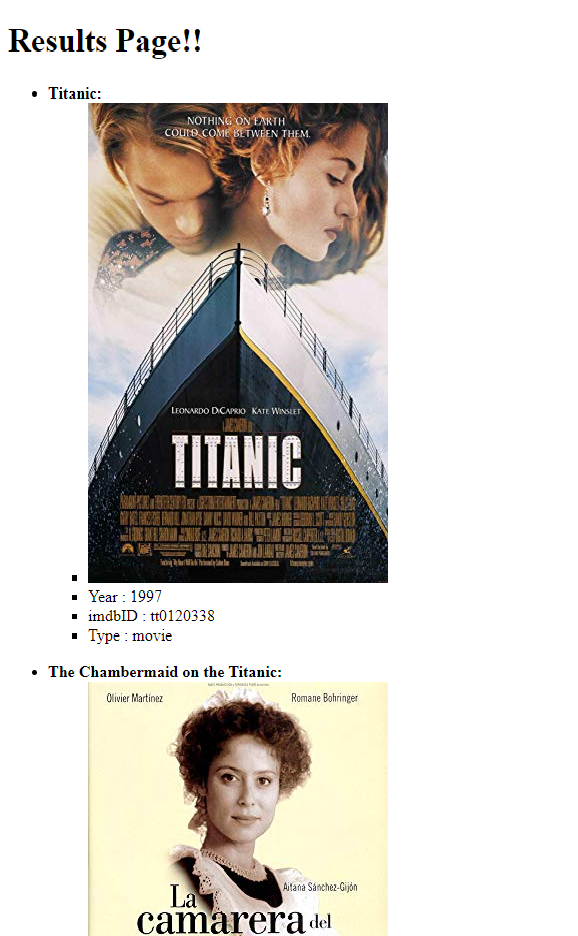
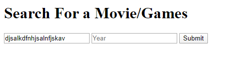

# Movie-Games-Search

1.Project description:
  - Personal project on a web application that gathers API information from https://omdbapi.com/ using Javascript and Node.js.
  - Setup an Express Server provides RESTful API and used EJS to implement the UI 
  - Allowed users to input Name and published year to request specific information about the Movie/Game
  - Used Heroku to maintain constant uptime
  
2.How to run:
  - Heroku URL: https://boiling-forest-56544.herokuapp.com/
  - Demo:
    + 
    + 
    + 
    + 
